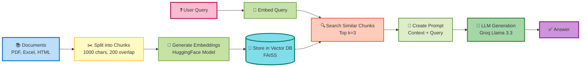

RAG Pipeline - Document System

A Retrieval-Augmented Generation (RAG) system that enables intelligent question-answering from PDF documents using LangChain, Groq, and vector databases.

## 🏗️ Architecture

### RAG Pipeline Flow

### Key Components

1. **Document Ingestion**: Supports PDF, Excel, HTML, and database sources
2. **Text Chunking**: RecursiveCharacterTextSplitter with 1000 char chunks and 200 char overlap
3. **Embeddings**: HuggingFace sentence-transformers (all-MiniLM-L6-v2)
4. **Vector Storage**: FAISS for efficient similarity search
5. **LLM**: Groq's llama-3.3-70b-versatile for fast, high-quality responses

PDF Document Processing: Load and process multiple PDF files

Intelligent Chunking: Smart text splitting with overlap for context preservation

Vector Search: FAISS-based semantic search for relevant document retrieval

Free & Fast LLM: Powered by Groq's high-speed inference

Local Embeddings: Uses HuggingFace sentence transformers

Multiple Vector Store Options: Support for FAISS and Typesense

Flexible Configuration: Easy to customize chunk sizes and retrieval parameters

Prerequisites

Python 3.8+

Groq API Key,Typesense API Key